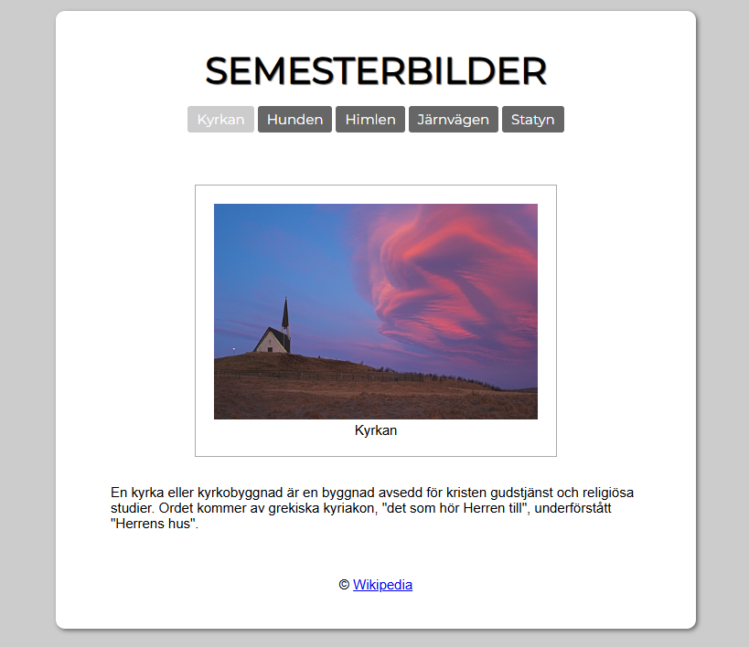

[](https://classroom.github.com/online_ide?assignment_repo_id=21839879&assignment_repo_type=AssignmentRepo)
# Prov 3a
## Inspelning av hela provet krävs för godkänt prov
1. Starta inspelningen i **OBS Studio**
1. Arbeta med uppgiften
1. När du är klar **commit & sync**
1. Stoppa inspelningen i **OBS Studio** och lämna in videon på **Classroom**

## Provet


## Instruktioner
- Skapa en liten webbplats på 5 sidor, med en bild på varje sida som skärmdumpen ovan.
- Sidan är **700px** bred och centrerad.
- Webbplatsen ska innehålla en horisontell meny, en bild under menyn, liten bildtext, och en sidfot med länk till Wikipedia.

### Rubriken
- Formatera rubriken med [Google Fonts Montserrat](https://fonts.google.com/specimen/Montserrat):
```CSS
@import url(https://fonts.googleapis.com/css?family=Montserrat);
```

### Menyn
- Formatera också menyn med [Google Fonts Montserrat](https://fonts.google.com/specimen/Montserrat).
- Knapparna ska vara gråa.
- Den aktiva sidan ska markeras med **ljusgrå**.

### Texten
- Bilden ska ha en bildtext.
- Formatera text och bildtext med "sans-serif".

## Kvalité
* Kommentera din kod.
* Indentera din kod så den är tydlig att följa.

## Dokumentation
Se bifogad [lathund](lathund-html-css.md).

### CSS-reset

Du kan använda följande CSS-reset för att nollställa alla standardvärden i webbläsaren:
```css
/* Enkel CSS-reset */
html {
    box-sizing: border-box;
}
*, *:before, *:after {
    box-sizing: inherit;
}
body, h1, h2, h3, h4, h5, h6, p, ul {
    margin: 0;
    padding: 0;
}
img {
    max-width: 100%;
    height: auto;
}
```

## Texter som används
> En kyrka eller kyrkobyggnad är en byggnad avsedd för kristen gudstjänst och religiösa studier. Ordet kommer av grekiska kyriakon, "det som hör Herren till", underförstått "Herrens hus".

> Hund (Canis lupus familiaris eller Canis lupus domesticus, tidigare även Canis familiaris) är en domesticerad underart av varg (Canis lupus) och den vetenskapliga läran om hundar kallas kynologi.

> Himlen är jordens atmosfär sedd från jordytan. Himlen är blå (eller grå vid dåligt väder) på dagen och med nyanser av rött eller gult vid soluppgång och solnedgång, på grund av Rayleigh-spridning av solljus i atmosfären.

> Järnväg är ett spårbundet transportmedel för tåg på särskild banvall för gods eller passagerare. Som järnväg räknas vanligen bara sammanhängande spårsystem för långdistanstrafik, och alltså inte spårväg, spårtaxi, tunnelbana eller gruvspår.

> Staty, från franskans statue (från latinets statua), är en skulpturell avbildning av en varelse, ofta en människa eller ett djur, och normalt i full skala och litet mindre samt litet större. Statyer är de vanliga inslag i parker och andra offentliga miljöer.

### Färger som används

* <code style="background:#666; color:#000">#666</code>
* <code style="background:#aaa; color:#000">#aaa</code>
* <code style="background:#ccc; color:#000">#ccc</code>
